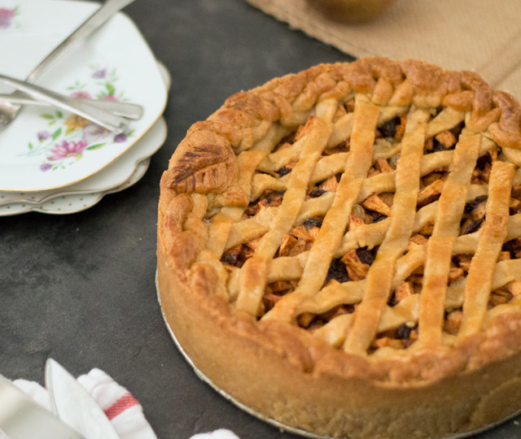

## Inleiding
In deze opdracht ga je oefenen met wat je tot nu geleerd hebt over beslissingsstructuren en methodes. En het laten uitprinten van een appeltaart recept door je applicatie!

## Opzetten van een nieuw Java project

1. Open IntelliJ op je computer.

2. Kies rechts bovenin voor _New project_.

3. Op het volgende scherm zie je linksboven dat _Java_ blauw geselecteerd is. Daar klik je op _Next_.

4. Op het volgende scherm hoeven we niks te selecteren en kunnen we gewoon op _Next_ klikken.

5. Op het volgende scherm kunnen we een naam meegeven aan het project. Kies altijd een beschrijvende naam die iets zegt over je project zodat je ook weet wat erin staat. Bijvoorbeeld "javaOpdracht1".

6. Klik daarna op 'Finish'.

## Opdrachtbeschrijving

Maak in het nieuwe Java project dat je hebt gemaakt een main klasse en een `public static void main` methode.

We gaan het volgende appeltaart recept uit laten printen door de applicatie:

Ingrediénten:

- 200 gram ongezouten roomboter
- 200 gram witte bastard suiker
- 400 gram zelfrijzend bakmeel
- 1 stuk(s) ei
- 8 gram vanillesuiker
- 1 snuf zout
- 1.5 kilo zoetzure appels
- 75 gram kristal suiker
- 3 theelepels kaneel
- 15 gram paneermeel

Stappen:
- Verwarm de oven van te voren op 170 graden Celsius (boven en onderwarmte)
- Klop het ei los en verdeel deze in twee delen. De ene helft is voor het deeg, het andere deel is voor het bestrijken van de appeltaart.
- Meng de boter, bastard suiker, zelfrijzend bakmeel, een helft van het ei, vanille suiker en een snufje zout tot een stevig deeg en verdeel deze in 3 gelijke delen.
- Schil nu de appels en snij deze in plakjes. Vermeng in een kopje de suiker en kaneel.
- Vet de springvorm in en bestrooi deze met bloem
- Gebruik een deel van het deeg om de bodem van de vorm te bedekken. Gebruik een deel van het deeg om de rand van de springvorm te bekleden. Strooi het paneermeel op de bodem van de beklede vorm. De paneermeel neemt het vocht van de appels op.
- Doe de heft van de appels in de vorm en strooi hier 1/3 van het kaneel-suiker mengsel overheen. Meng de ander helft van de appels met het overgebleven kaneel-suiker mengsel en leg deze in de vorm.
- Rol het laatste deel van de deeg uit tot een dunne lap en snij stroken van ongeveer 1 cm breed.
- Leg de stroken kuislings op de appeltaart. Met wat extra deegstroken werk je de rand rondom af. Gebruik het overgebleven ei om de bovenkant van het deeg te bestrijken
- Zet de taart iets onder het midden van de oven. Bak de taart in 60 minuten op 170 graden Celsius (boven en onderwarmte) gaar en goudbruin.

Nou kunnen we dit alles natuurlijk in de main met een System.out.println zetten en dan werkt het. Maar dat is niet wat we gaan doen. We gaan de applicatie netjes opbouwen met de kennis die je tot zo ver hebt opgedaan.

## Randvoorwaarden
De opdracht moet voldoen aan de volgende voorwaarden:

- minimaal 3 klassen genaamd: `Ingredient`, `ApplePieRecipe` en `Main`
- minimaal 3 variabelen, 2 constructors en getters en setters in `Ingredient`
- minimaal voor elk ingredient dat hierboven genoemd is een object geinstanieerd in `ApplePieRecipe`
- minimaal voor elke stap die hierboven genoemd word een methode die de tekst via een `System.out.println()` uitprint
- minimaal 1 object van het type `ApplePieRecipe` om de tekst uit te kunnen printen in de `Main` klasse

## Extra opdrachten

1. Zou je ook een methode kunnen maken die alle stappen uitprint? Dan hoef je niet alle methode aan te roepen van uit de `Main` klasse. Ziet dat er niet een stuk netter uit?
2. Zou je dit misschien met meer recepten kunnen doen? Probeer zelf een recept toe te voegen en op de zelfde manier uit te voeren als het appeltaart recept.
